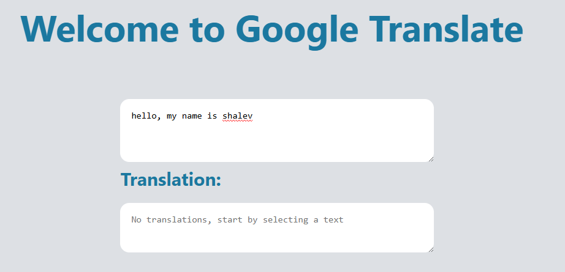
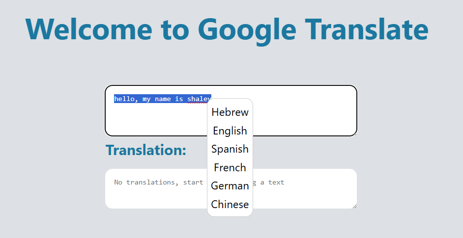
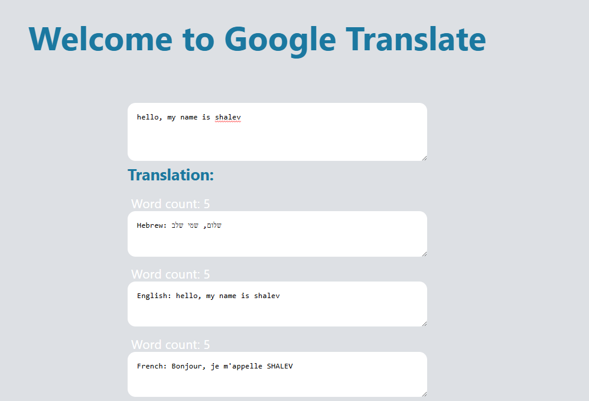

# React Translation Application 

This React application allows users to translate selected text into multiple languages using the Google Translate API. The app provides a seamless user experience with a context menu for language selection, displays translations with word counts, and highlights the selected text.

🔗 **Live Demo:** [https://google-translate-app-eta.vercel.app/](https://google-translate-app-eta.vercel.app/)

## Features ✨

- **Text Selection**: Users can select text within a textarea.
- **Context Menu**: Right-click on the selected text to choose a target language from the context menu.
- **Translations**: View translations of the selected text in various languages.
- **Word Count**: Displays word count for the selected text along with the translations.

## Screenshots 📸

A visual guide for translating text on a website:

  
*Writing the text in the box.*

  
*Select text to translate and right-click to select the language.*

  
*Translating text into a variety of languages.*

## Installation 🛠️

### 1. Clone the Repository

Clone the repository to your local machine using the following command:

```bash
git clone https://github.com/your-username/react-translation-app.git
cd react-translation-app
